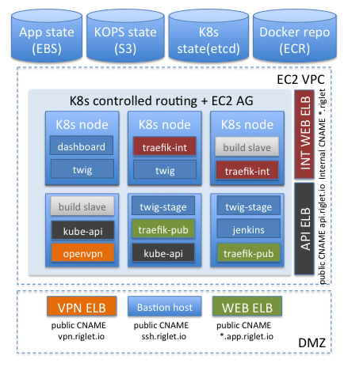

= RIG 3.0

== Goals

* Quick and simple rig deployment (should not include so many steps)
* Simple application installation (single click deployment for new components)
* Portability (option to deploy on Azure, AWS, GCE or on-premises)
* Open design (option to add new / remove outdated components without major effort)

== Starting point ideas

* Each rig component is a an individual docker container
* Use compose as a basic network and name resolution (https://docs.docker.com/compose/networking/)
* Use edge proxy (traefik) with dynamic backend registry
* Map wildcard name to route 53 record backed by ELB and software edge proxy
* Convert openvpn to docker container (https://github.com/kylemanna/docker-openvpn[docker-openvpn])
* Use dynamic jenkins docker slaves
* Run Nexus on docker https://github.com/sonatype/docker-nexus3[docker-nexus3]
* Use docker image compression
* Use dockerfile linter (https://github.com/lukasmartinelli/hadolint)

== Evolution of the RIG, part 3

. Original idea was to start with docker-compose
.. Simple
.. Does not scale (single machine only)
. Next iteration was about Docker Swarm Mode (new in 1.12)
.. Scales
.. No good tooling (too young)
.. No cloud integration (you want to use ELB, EBS - you configure and maintain it)
. Kubernetes version
.. Scales
.. Super popular (20k stars on GitHub, evolves very quickly, has tons of tools)
.. Supports Azure, AWS and GCE
.. Way more complex than plain Docker (almost like Convox)

== RIG 3.0 today

. Runs on k8s
.. Local version is https://github.com/kubernetes/minikube[minikube]-based
.. EC2 version is deployed via https://github.com/kubernetes/kops[kops]
. Uses https://github.com/containous/traefik[Traefik] as Ingress controller for HTTP traffic
.. There are two instances of Traefik: internal and public
.. Public instance is accessible from the Internet via public ELB (or NodePort in case of Minikube)
.. Each traefik instance uses Ingress selector to limit number of exposed resources
.. Wildcard CNAME mapping (i.e. *.app.riglet.io and *.app.riglet) routes requests to ingress controller
.. Traefik uses hostname-based backend dynamic request routing
. All rig components are deployed as k8s services
.. Jenkins master does not execute any builds
.. OpenVPN server runs as a service and exposed via ELB
.. Nexus/Sonar/Jenkins use EBS persistent storage
. Jenkins uses kubernetes to dynamically provision slaves
.. Solution is based on https://github.com/jenkinsci/kubernetes-plugin[Kubernetes Plugin]
.. Slave lifetime is limited by single job execution (like in Travis CI)
.. Use stock images as much as possible (builder pod may use any number of containers)
.. All containers share same temporary workspace volume
. App delivery pipeline is k8s-centric
.. Jenkins requests new pod-based slave creation (pod configuration is described in Jenkins pipeline DSL)
.. Slave executes application build in corresponding container (i.e node:7)
.. Slave executes packaging and image push in stock docker container
.. Slave requests application staging update using stock kubectl container
.. Slave executes acceptance tests (using headless-chrome container)
. EC2 version uses ECR
.. ECR is used to store all custom docker images (both rig components and applications)
.. ECR authentication is handled by IAM role of k8s node (no need to explicitly pass creds)

== Advantages over 2.0

. More modular
.. Each component is isolated and may be modified / tested independently
.. Application dependencies are separated from the Rig (you need node:7 - you bring container)
.. It's possible to create any number of isolated application/component deployments
. Better resource utilization
.. It's possible to colocate several components on the same host
.. It's possible to set CPU/RAM limits for each component
. No extensive configuration
.. Pull existing images instead of installing and configuring individual packages
. No hard dependency on AWS
.. No need to use Convox
.. Full application build and deploy may be executed on developer's machine

== To be done
. Automate bastion host creation, S3 and route53 configuration steps
. OpenVPN-AD authentication
. Adopt helm to support more portable manifests
.. EC2-specific parts
.. Environment-specific parameters
.. Better change management support
. Add performance monitoring
. Add better logging (now it is console-based and keeps just last 50M)
. Test setup on GCE
. Better documentation
. Use docker hub for publicly available images?